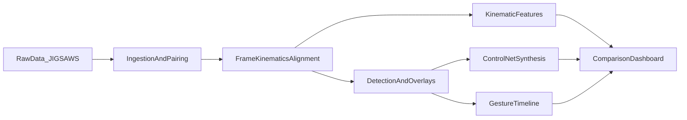

# Clean Repo Plan for Suturing Stable Diffusion Pipeline

## Goal

Build a clean, reproducible project structure around your current notebook while preserving the original file as a reference artifact.

## Source Artifact to Preserve

- Keep original notebook unchanged at: `[/Users/amyngo/Desktop/suturing_detection_prediction_pipeline (1).ipynb](</Users/amyngo/Desktop/suturing_detection_prediction_pipeline%20(1)`.ipynb>)
- Copy it into new repo as a versioned snapshot under `versions/`.

## New Repository Location

- Create new repo folder on Desktop (suggested name: `suturing-stable-diffusion-pipeline`).

## Proposed Repository Structure

- `README.md` — project overview, quickstart, dataset expectations, phase roadmap.
- `.gitignore` — Python/Jupyter/model-artifact ignores.
- `requirements.txt` (or `environment.yml`) — pinned runtime dependencies.
- `versions/`
  - `suturing_detection_prediction_pipeline_v1.ipynb` (copied from source)
- `notebooks/`
  - `01_data_ingestion_and_alignment.ipynb`
  - `02_detection_and_labeling.ipynb`
  - `03_kinematic_analysis.ipynb`
  - `04_controlnet_synthesis_and_dashboard.ipynb`
- `src/suturing_pipeline/`
  - `config.py` (central paths/config)
  - `data/loader.py` (trial discovery + modality pairing)
  - `data/frame_extractor.py` (OpenCV extraction utilities)
  - `data/alignment.py` (kinematics ↔ frame index mapping)
  - `detection/yolo_detector.py` (extract from `YoloDetector`)
  - `detection/motion_detector.py` (extract from `ClassicalMotionDetector`)
  - `detection/export.py` (save frames/crops/metadata)
  - `sequence/dataset.py` (extract from `ClipSequenceDataset`)
  - `sequence/model.py` (extract from `DetectionToPredictionModel` + encoder/attention)
  - `kinematics/features.py` (velocity/accel/jerk + smoothing)
  - `synthesis/controlnet_pipeline.py` (ControlNet/SVD orchestration stub)
  - `dashboard/app.py` (Streamlit/Gradio synchronized comparison app)
  - `utils/io.py`, `utils/visualization.py`
- `scripts/`
  - `prepare_trials.py`
  - `run_detection.py`
  - `compute_kinematics.py`
  - `run_synthesis.py`
  - `launch_dashboard.py`
- `configs/`
  - `base.yaml`, `local.yaml.example`
- `tests/`
  - `test_alignment.py`
  - `test_kinematic_features.py`

## What to Migrate from Current Notebook First

From `[/Users/amyngo/Desktop/suturing_detection_prediction_pipeline (1).ipynb](</Users/amyngo/Desktop/suturing_detection_prediction_pipeline%20(1)`.ipynb>), migrate these proven blocks first:

- Video utilities: `get_video_info`, frame extraction helpers.
- Detection modules: `YoloDetector`, `ClassicalMotionDetector`.
- Sequence learning modules: `ClipSequenceDataset`, `DetectionToPredictionModel`, and helper classes.
- Output/export helpers (metadata CSV/JSON and video export utilities).

## Gaps to Implement for Your PDF Plan

1. **Phase 1 completion:** multi-trial JIGSAWS loader that pairs `capture1/capture2 + kinematics + transcription`.
2. **Phase 2 completion:** gesture labeling from transcription mapped onto frame-level detections.
3. **Phase 3 build-out:** velocity, acceleration, jerk, smoothing, and optional GRS correlation.
4. **Phase 4 build-out:** ControlNet-conditioned synthesis (plus temporal coherence path via SVD/AnimateDiff).
5. **Dashboard:** synchronized 3-panel videos + kinematic chart + gesture timeline + GRS radar.

## Architecture Flow

## Implementation Sequence

- Step 1: Scaffold repo and baseline docs/config.
- Step 2: Copy original notebook into `versions/` and create slim phase notebooks.
- Step 3: Extract reusable code from notebook into `src/suturing_pipeline/*` modules.
- Step 4: Add CLI scripts to run each phase without notebook dependence.
- Step 5: Add minimal tests for alignment and kinematic feature math.
- Step 6: Add dashboard skeleton with synchronized playback controls.
- Step 7: Add synthesis stubs and integration points for ControlNet/SVD.

## Definition of Done

- Original notebook preserved separately in `versions/`.
- Core pipeline runs from scripts using modular source code.
- Repo is clean to publish (no raw data, no model weights, no large generated artifacts).
- README documents setup + phase-by-phase usage + next tasks for model training/fine-tuning.
